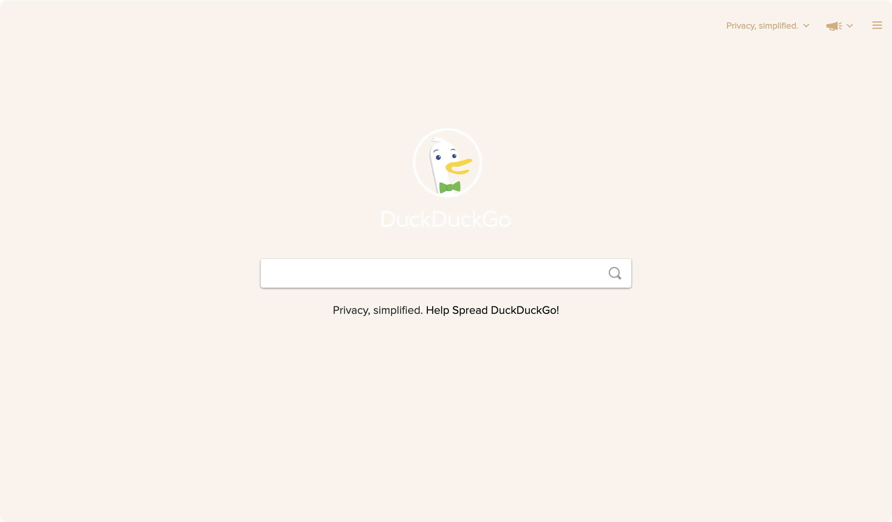

<p align="center">
    
    <h2 align="center">Rosé Pine for DuckDuckGo</h2>
</p>

<p align="center">All natural pine, faux fur and a bit of soho vibes for the classy minimalist</p>

<p align="center">
    <a href="https://github.com/rose-pine/rose-pine-theme">
        
    </a>
</p>

## Usage

1. Visit <https://duckduckgo.com>
2. Right click and select the “Inspect” button.
3. Select the “Console” tab.
4. If you are using Firefox, type `allow pasting`.
5. Enter one of the following scripts

for rose-pine:
```js
const theme = [
  '1=-1', 'at=-1', 'ao=-1', 'aq=-1', 'ak=-1', 'ax=-1', 'av=1', 'ap=-1', 'au=-1', 'ay=b', 'ae=-1', '18=1',
  '7=191724', 'j=191724', '9=9ccfd8', 'x=31748f', 'aa=c4a7e7', '8=e0def4', '21=191724',
];

for (const item of theme) {
  document.cookie = `${item}; max-age=126144000; samesite=lax; secure`;
}
```

for rose-pine-moon:
```js
const theme = [
  '1=-1', 'at=-1', 'ao=-1', 'aq=-1', 'ak=-1', 'ax=-1', 'av=1', 'ap=-1', 'au=-1', 'ay=b', 'ae=-1', '18=1',
  '7=191724', 'j=191724', '9=9ccfd8', 'x=3e8fb0', 'aa=c4a7e7', '8=e0def4', '21=191724',
];

for (const item of theme) {
  document.cookie = `${item}; max-age=126144000; samesite=lax; secure`;
}
```

for rose-pine-dawn:
```js
const theme = [
  '1=-1', 'at=-1', 'ao=-1', 'aq=-1', 'ak=-1', 'ax=-1', 'av=1', 'ap=-1', 'au=-1', 'ay=b', 'ae=-1', '18=1',
  '7=faf4ed', 'j=faf4ed', '9=d7827e', 'x=286983', 'aa=907aa9', '8=1f1d2e', '21=faf4ed',
];

for (const item of theme) {
  document.cookie = `${item}; max-age=126144000; samesite=lax; secure`;
}
```

## Demo
Visit one of the following links:
- [rose-pine](https://duckduckgo.com/?kae=-1&kah=ph-en%2Cuk-en&kl=ph-en&k1=-1&kat=-1&kao=-1&kaq=-1&kak=-1&kax=-1&kav=1&kap=-1&kau=-1&kay=b&k18=1&k7=191724&kj=191724&k9=9ccfd8&kx=31748f&kaa=c4a7e7&k8=e0def4&k21=191724)
- [rose-pine-moon](https://duckduckgo.com/?kae=-1&kah=ph-en%2Cuk-en&kl=ph-en&k1=-1&kat=-1&kao=-1&kaq=-1&kak=-1&kax=-1&kav=1&kap=-1&kau=-1&kay=b&k18=1&k7=191724&kj=191724&k9=9ccfd8&kx=3e8fb0&kaa=c4a7e7&k8=e0def4&k21=191724)
- [rose-pine-dawn](https://duckduckgo.com/?kae=-1&kah=ph-en%2Cuk-en&kl=ph-en&k1=-1&kat=-1&kao=-1&kaq=-1&kak=-1&kax=-1&kav=1&kap=-1&kau=-1&kay=b&k7=faf4ed&kj=faf4ed&k9=d7827e&kx=286983&kaa=907aa9&k8=1f1d2e&k21=faf4ed&k18=1)

## Userscript
Alternatively, use a [userscript manager extension](https://www.tampermonkey.net/). Install the userscript by clicking one of the following links:
- [rose-pine](https://raw.githubusercontent.com/cobcobs/duckduckgo/main/rose-pine.user.js)
- [rose-pine-moon](https://raw.githubusercontent.com/cobcobs/duckduckgo/main/rose-pine-moon.user.js)
- [rose-pine-dawn](https://raw.githubusercontent.com/cobcobs/duckduckgo/main/rose-pine-dawn.user.js)

## Gallery




## Thanks to

- [cobcobs](https://github.com/cobcobs)
- [catppuccin duckduckgo repository](https://github.com/catppuccin/duckduckgo)
